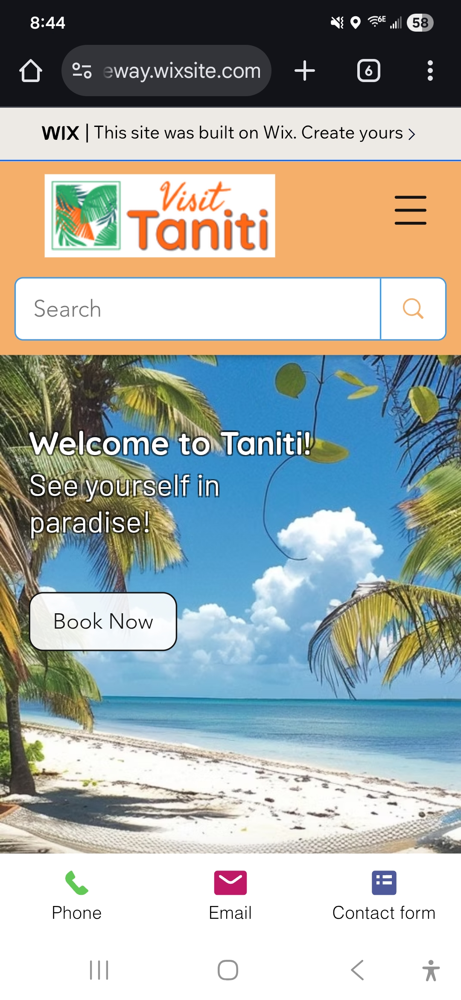

# Taniti Travel Website (UX/UI Project)

A responsive travel website prototype for the fictional island of Taniti, focused on user experience, clear navigation, and visual design.

🔗 Live Site: https://jennajaneway.wixsite.com/taniti

## Project Goals

- Design an intuitive tourism website
- Create clear navigation for visitors
- Present destination information in a user-friendly layout
- Apply UX/UI best practices

## Key Features

- Clean, modern layout
- Consistent visual branding
- Mobile-responsive design (Wix platform)
- Organized content structure

## Tools Used

- Wix Website Builder
- UI/UX design principles
- Visual layout and branding

## Screenshots

### Homepage

### Activities / Content Page

### Mobile View

